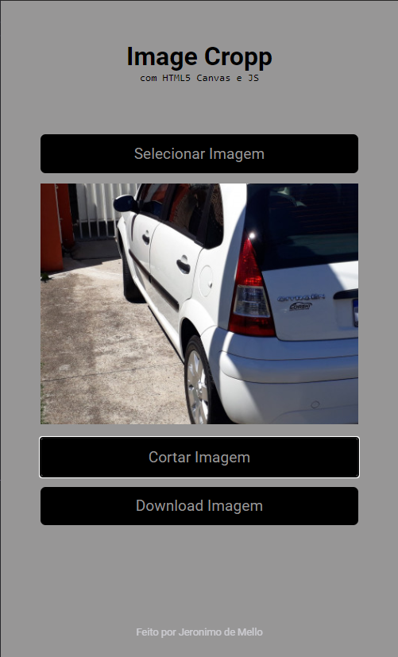

# cropp-image-tool
[![NPM Version][npm-image]][npm-url]
[![Build Status][travis-image]][travis-url]
[![Downloads Stats][npm-downloads]][npm-url]

Este projeto é um mini-app que faz cortes em imagens e faz download das mesmas,
usando canvas e Javascript.



## Instalação

OS X & Linux:
Vá até a pasta onde o repositótio foi clonado e com o git bash execute o lite-server
```sh
npx lite-server
``` 

Windows:
Vá até a pasta onde o repositótio foi clonado e com o git bash execute o lite-server
```sh
npx lite-server
```


## Configuração para Desenvolvimento

O presente projeto não possui nenhuma dependencia, por se tratar de um mini-app tem varias funcionalidades não implementadas

```sh
make install
npm test
```

## Histórico de lançamentos

* 0.0.1
    * primeiro commit do codigo funcional

## Meta

Jeronimo de Mello – [@JeronimoDeMello](https://twitter.com/...) – jeronimolider@gmail.com

Distribuído sob a licença XYZ. Veja `LICENSE` para mais informações.

[https://github.com/JeronimoDeMello/github-link](https://github.com/Jere201086)

## Contributing

1. Faça o _fork_ do projeto (<https://github.com/Jere201086/cropp-image-tool/fork>)
2. Crie uma _branch_ para sua modificação (`git checkout -b feature/fooBar`)
3. Faça o _commit_ (`git commit -am 'Add some fooBar'`)
4. _Push_ (`git push origin feature/fooBar`)
5. Crie um novo _Pull Request_

[npm-image]: https://img.shields.io/npm/v/datadog-metrics.svg?style=flat-square
[npm-url]: https://npmjs.org/package/datadog-metrics
[npm-downloads]: https://img.shields.io/npm/dm/datadog-metrics.svg?style=flat-square
[travis-image]: https://img.shields.io/travis/dbader/node-datadog-metrics/master.svg?style=flat-square
[travis-url]: https://travis-ci.org/dbader/node-datadog-metrics
[wiki]: https://github.com/seunome/seuprojeto/wiki